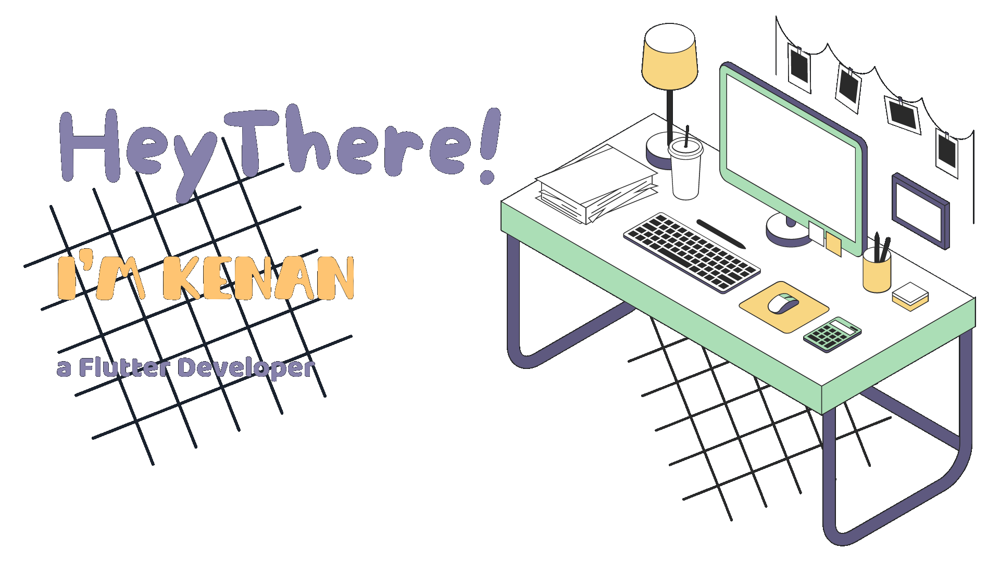

## Hello, World!
I'm Kenan, a Flutter developer based in Syria. 

## About me:
I'm currently pursuing a degree in Information Technology Engineering at Damascus University and building beautiful and functional mobile apps with Flutter. While Flutter is my main squeeze, I'm also comfortable with the classics: Python , HTML & CSS , and JavaScript (Full-Stack potential?) ✨.

## Tech stack

## Fun facts:
- I'm a night owl, but I like coding in the morning!
- My first line of code was not "Hello, World!"
- I believe in the power of a well-made cup of coffee ☕

## Connect or collaborate?
Feel free to reach out! 

## Here's a peek at what I'm working on:
